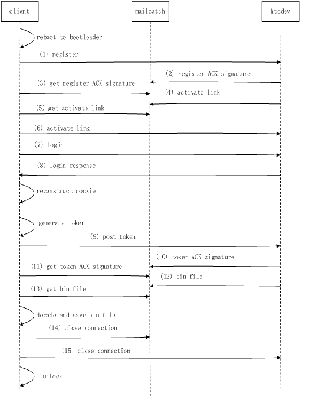

The website of HTC provide some steps to unlock it's mobile phone, the Python `unlock.py` script can automatic unlock HTC mobile phone according to the procedure of the website's suggestion. You should check to make sure if the procedure is still valid and update the script which I writed years ago.

Some tool programs like `adb.exe` `fastboot.exe` `AdbWinApi.dll` should be prepared in Windows system. I put them in the path `c:/htcunlock`, and the path is hard coded in the script. 

Before illustrating the procedure, some concepts are explained:
* Client: the HTC mobile phone connecting a Windows PC using USB.
* HTCDev server: the website which the script visit that execute unlock steps.
* Mailcatch: the temporary Email server. HTCDev server need an Email address to register an account.

Below is the work flow of the unlock script:

